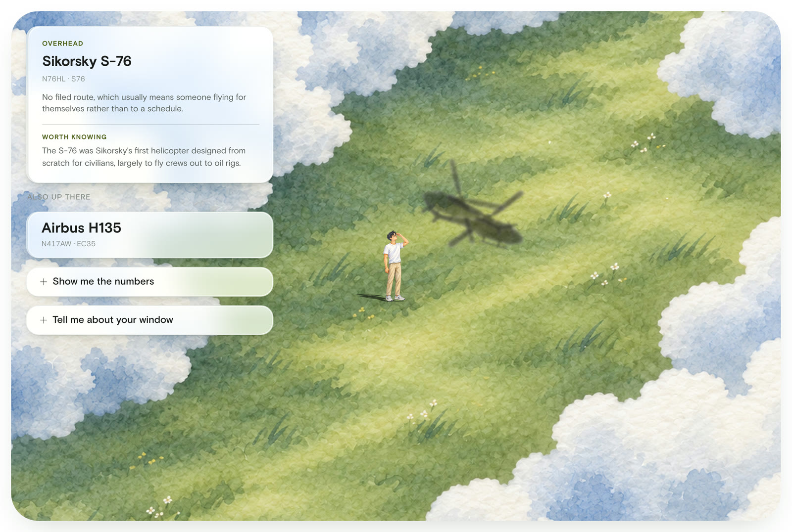
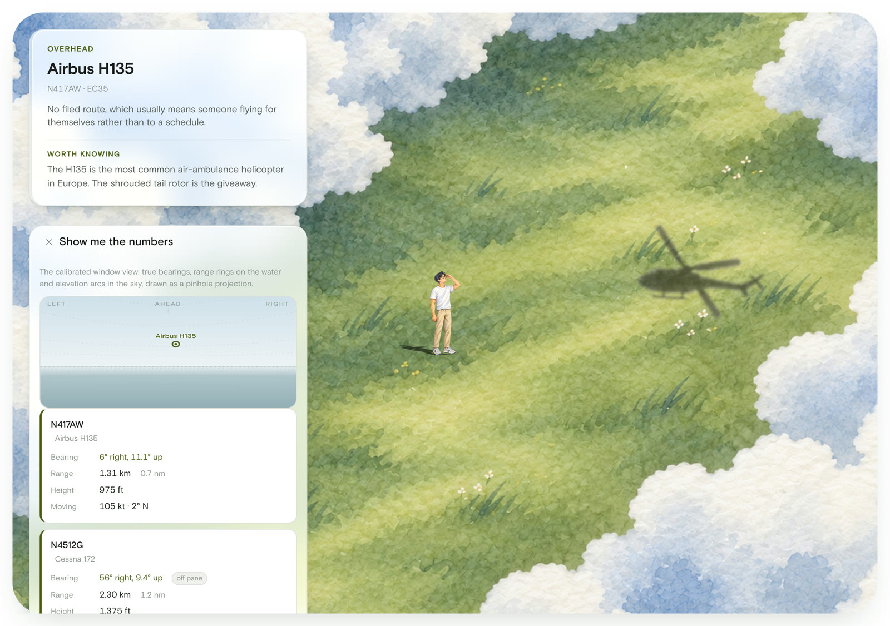

# Hudson Window

Identifies the planes and helicopters passing my apartment window in Newport,
Jersey City.



The main view is a painted field. A figure stands on the grass and the shadows
of real aircraft cross over him as they pass: entering from the side the
aircraft is really on, travelling the way it is really going, and growing when
it is close. The question it answers is **"what is that?"**, not "where do I
look". If a plane is overhead you look up and see it; nobody needs telling which
way to face.

```bash
node server.mjs --demo    # synthetic traffic, no network at all
node server.mjs           # live, on http://localhost:8808
```

No dependencies, no build step, no framework. One server file, one HTML file,
Node 22.

## Data sources

Three ADS-B aggregators in order, first usable answer wins. They cannot be
called from the browser: aisstream forbids it outright and the ADS-B
aggregators send no CORS headers, which is the only reason a server exists at
all. It also gives one shared 4-second cache instead of every open tab
hammering volunteer-run endpoints.

Three things that cost real debugging time:

| | |
|---|---|
| **adsb.lol says `ac`, adsb.fi says `aircraft`** | Same fields, different name for the array holding them. Reading only `ac` makes adsb.fi look like an empty sky. |
| **airplanes.live returns HTTP 200 with an error object** | It wants registration. A 200 is not success; the body has to be checked. |
| **An empty result is not an answer** | An empty 200 once became the sticky preferred source and stayed there. Empty is never made preferred, and only believed when every source is empty. |

Routes come from adsbdb.com by callsign, cached 6 hours (1 hour for misses).

## Geometry

All of it is in the front end; the server only fetches and merges.

- **Great-circle forward azimuth**, not the flat approximation. Measured against
  the flat version: **7.9 degrees** of error at this latitude, which is most of
  a window's width.
- **Pinhole projection** with one focal length for both axes. A linear
  degrees-to-pixels mapping put things **43 px** off near the edges.
- **Elevation against an Earth radius inflated for refraction** (k = 0.13), so
  the curve drop is right and the horizon sits where it actually sits.
- **Dead reckoning** from course, speed and vertical rate between polls,
  anchored to the age of the data rather than to wall-clock time. Getting that
  anchor wrong is what made the marker visibly jitter backwards once per poll.
- **NOAA solar position** drives the day and night look, and the direction and
  length of every shadow. Checked against both solstices: 72.7 and 25.8 degrees,
  exact.

## The shadows

`airplaneShadow.png` and `helicopterShadow.png`, painted to match the field.
Three things were measured rather than guessed.

**Each PNG is pre-rotated**, so pointing one along a flight path means
correcting for the angle it was painted at. Taken from the principal axis of the
alpha channel: the jet's fuselage runs **13 degrees above** horizontal, the
helicopter's **27.5 below**.

**The painted shape does not fill its file**, 83% of the width for the jet and
90% for the helicopter, from the alpha bounding box. The image is scaled by the
reciprocal so the requested span is the aircraft, not the canvas around it.

**They are mirrored, not rotated, past 90 degrees.** Neither is a flat plan
view: the helicopter's skids hang below its cabin, so rotating it past vertical
put the skids on top and the machine read as upside down. Past 90 the silhouette
is mirrored across its own nose-tail axis instead, which leaves anything on that
axis untouched and swaps everything either side. An aircraft is near enough
symmetric for the result to be indistinguishable.

**A shadow softens with height.** Blurred by `0.6 + 3.2px per km` of altitude and
faded 22% per km, so a helicopter at 300 m lands crisp and an airliner overhead
is a soft grey smudge. Both bounded: blur capped at 6% of the drawn span or a
distant aircraft dissolves entirely, fade floored at 0.45 or it vanishes into
the grass.

The figure's own shadow is his silhouette sheared onto the ground by the sun's
real azimuth, not an ellipse under his feet. It scales from his height, so
shrinking him shrinks it.

## Type

**Basis Grotesque Pro**, five static cuts, reached only through the `--sans`
token.

**The weights are declared as ranges, not points.** The stylesheet asks for 560,
580, 600, 640 and 650, numbers chosen when this ran on a variable system font.
CSS weight matching above 500 searches *upwards* first, so every one of those
would have resolved to Bold and the Medium cut would never have been used.
Medium is declared `451 600` and Bold `601 800`, which puts the split where the
design does.

**The files are the Arabic Pro cuts**, which sounds like a problem for a page
with no Arabic in it. Their cmap was parsed rather than trusted: full Latin
coverage, including the `→` and `·` used in routes and idents.

**There is no monospace font.** Basis carries tabular figures, which was the one
thing the system mono was doing here. Measured: every digit exactly 7.625px
under `font-variant-numeric: tabular-nums`, against a 4.4px spread without it,
so `1.61 km` and `20,575 ft` still align down a card. Every rule that used the
old `--mono` token now sets that property, and the alignment depends on it.

## The panels

Liquid glass. Four things together make a panel read as a lens rather than a
translucent grey rectangle, and it needs all four: a backdrop that is brightened
and saturated as well as blurred, a fill that is a gradient rather than a flat
wash, light bouncing in off both the top and bottom inner edges, and a specular
rim brightest at two opposite corners rather than glowing evenly all the way
round. The shadow is three layers, one tight contact shadow plus two wide
ambient ones; a single large blur reads as a sticker.

The rim is a gradient-filled ring: a pseudo-element the size of the panel,
filled with the gradient, then masked down to its own 1px border by subtracting
its content box from itself.

**Saturation is a legibility setting, not a taste one.** At `saturate(200%)`
over a green meadow the panels turn green and the small ident text drops to
2.4:1. Measured properly, by replaying the backdrop filter on a canvas,
compositing the fill and computing WCAG contrast against the real ink colour,
because a glass panel's effective background is not any colour in the
stylesheet. `saturate(170%)` holds every other text layer at 5:1 or better.

**Nothing drawn on a panel can use an opaque colour.** A divider set in a fixed
near-white grey read fine where grass showed through and vanished where sky did,
because a see-through panel's own lightness changes with whatever is behind it.
Rules are translucent ink now, darkening whatever they sit on by a constant
fraction. Measured across the rule's length: 19% variation before, 3% after.

**The sliders are hand-built.** `accent-color` gives the two-tone fill for free,
but Chrome paints a hairline around the unfilled track as part of its native
rendering and that outline is not reachable from CSS. Setting `border: none`
reports 0px and changes nothing on screen, because the border property is not
what draws it. `appearance: none` removes it along with the native painting, so
the fill is rebuilt as a hard-stopped gradient driven from the value.

## Concentric corners

Every radius on screen traces back to the painting. The artwork's own corner is
974 px on a 6504 px-wide canvas, so the scene clips at **15.15%** of the card
width, and the panels inside satisfy `inner radius + padding = outer radius`.
Nothing is a round number someone liked.

## The calibration panel

Three settings, down from seven. Which ones survived was decided by sweeping
each across its full range and counting the aircraft that actually reached the
screen.

| Setting | Swept | Aircraft on screen |
|---|---|---|
| Which way the window faces | 0 to 315 degrees | 5, 4, **0** |
| How wide the view is | 30 to 150 degrees | **0**, 1, 4 |
| How far out to look | 2 to 14 km | **1**, 3, 4 |
| Looking up or down | -15 to +30 degrees | 4, 4, 4, 4, 4 |
| How high your window is | 0 to 300 m | 4, 4, 4, 4, 4 |

Pitch changed nothing across three quarters of its range; eye height changed
nothing at all. Neither is a bug. Both were load-bearing when this drew ships,
where eye height sets the horizon dip and decides when a hull drops below the
curve. With vessels hidden they had nothing left to do, because aircraft are too
high and too close for 300 m of eye height to matter. Both still exist at their
defaults and the projection still reads them; only the controls are gone.

**Facing is a true bearing.** Declination here is about **13 degrees west**, so a
heading read off a phone compass and typed in raw is 13 degrees wrong. There is
a checkbox for it.

Latitude and longitude are shown, not edited. They are an address, not a
preference, and the server is the authority through `HW_LAT` and `HW_LON`.

## Identification

`plainKind` is decided on the server and **order matters**: helicopter, then
cargo, then business-jet type, then charter, then scheduled airline, then weight
band. Helicopters come from the ADS-B `category` field (`A7` = rotorcraft),
not from guessing at the type code.

**`ownOp` is the registered owner, not the airline.** AAL1942 comes back as
"U S BANK NA TRUSTEE", which is true and useless. The callsign-prefix table wins.

Small details that took a second look: the C750 is the Citation X, not the
Longitude. And "an United jet" is wrong, because the U is a Y sound, so the
article is special-cased.

## Voice

The section labels were dashboard furniture. There is one big card and a short
list under it; nobody needs a label to work out that the small ones are also
aircraft. The card names what the thing is, and "Did you know" became "Worth
knowing" because the facts underneath are good enough not to need propping up.

**The empty sky was the least-considered sentence in the app and by far the
most-read.** Sampling this window put something inside 5 km about half the time
and inside 3 km one time in eight, so "Nothing in your window" was what the
screen said most of the time anyone looked at it. It rotates now, keyed to the
minute rather than the poll so it does not reshuffle while you read it.

The copy also described the app's problems rather than the sky. "No published
route" is a statement about a missing database record; what it means is someone
flying for themselves rather than to a timetable, which is more interesting than
a scheduled airliner. It says that instead.

## Two bugs worth remembering

**`.field` meant two things.** The class was on both the scene's painting layer
and every row of the calibration form, so `background-image: url(dayView-bg.jpg)`
painted a full meadow behind all nine form rows. Both names were plausible in
their own context, nothing errored, and the form only looks wrong once you open
a panel that is collapsed by default.

**`[hidden]` loses to `display`.** The window pane's empty note is hidden from
script with `el.hidden = true`, and a `display: grid` rule in the stylesheet
silently cancelled it, so "Looking…" sat over the pane while aircraft were drawn
behind it. A stylesheet `display` declaration beats the browser's own
`[hidden] { display: none }`.



## Constraints

- No npm dependencies, no build step, no framework. One HTML file, one server
  file.
- `node server.mjs --demo` must keep working with synthetic traffic and zero
  network.
- Both light and dark themes stay correct. Colours come from the CSS custom
  properties at the top, never hardcoded.
- Air is the orange token and water the teal token. That mapping is load-bearing
  for reading the screen at a glance. Air was retuned to a green sampled from
  the painting at the owner's request; water is still teal, and the two remain
  100 degrees apart in hue.
- The 4-second server-side aircraft cache is deliberate. Do not remove it.

## Environment

| | |
|---|---|
| `HW_LAT` / `HW_LON` | Server query origin. The UI warns when it has drifted from the browser's own setting. |
| `AISSTREAM_KEY` | Vessels. Without it aircraft still work; vessels are hidden by default anyway. |
| `PORT` | Defaults to 8808. |
